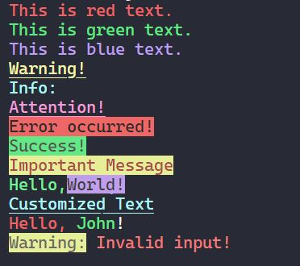

# Colorful Text Formatting

This code provides a utility for formatting text with different colors and styles in a terminal or console.



## Usage

1. Install the necessary dependencies:

   ```shell
   npm install ez-cli-color
   ```

2. Import the ez object to access the available formatting options:
   ```js
   const ez = require("ez-cli-color");
   ```
3. Format your text using the available options:
   ```javascript
   const formattedText = ez.<color>(text, options); // for text color
   const formattedText = ez.background.<color>(text, options); // for background color
   ```
   Replace <color> with one of the available color options, such as black, red, green, etc. You can also specify additional formatting options by providing an options object.
   ```js
   const formattedText = ez.red("Hello, world!", { bold: true });
   ```

## Available Colors

- `black`
- `red`
- `green`
- `yellow`
- `blue`
- `magenta`
- `cyan`
- `white`

## Available Options

The options object accepts the following properties:

- `underline` (boolean): Set to true to underline the text. Default: false.
- `bold` (boolean): Set to true to make the text bold. Default: false.

## Examples

Format text with different colors and options:

```js
const ez = require("./path/to/ez");

const formattedText1 = ez.red("Error occurred!", { bold: true });
console.log(formattedText1);

const formattedText2 = ez.yellow("Warning: Invalid input", { underline: true });
console.log(formattedText2);
```

## License

This code is licensed under the MIT License. See the LICENSE file for more information.
